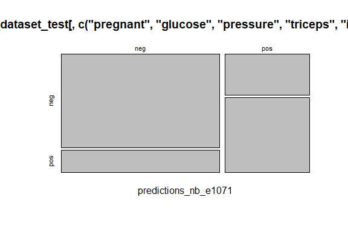

Business Intelligence Project
================
<Specify your name here>
<Specify the date when you submitted the lab>

- [Student Details](#student-details)
- [Setup Chunk](#setup-chunk)
- [Understanding the Dataset (Exploratory Data Analysis
  (EDA))](#understanding-the-dataset-exploratory-data-analysis-eda)
  - [Loading the Dataset](#loading-the-dataset)
    - [Source:](#source)
    - [Reference:](#reference)
- [**DATASET 1: Pima Indians Diabetes - Data Summary and
  Preprocessing**](#dataset-1-pima-indians-diabetes---data-summary-and-preprocessing)
- [**Exploring the Dataset
  Structure**](#exploring-the-dataset-structure)
- [**Utilizing the naiveBayes() Function in the “e1071”
  Package**](#utilizing-the-naivebayes-function-in-the-e1071-package)
- [**Testing the Trained Model on the Testing
  Dataset**](#testing-the-trained-model-on-the-testing-dataset)
- [**Examining the Model Results**](#examining-the-model-results)

# Student Details

|                                              |                                                      |
|----------------------------------------------|------------------------------------------------------|
| **Student ID Number**                        | 134782, 134783, 135232, 122998                       |
| **Student Name**                             | Yasmin Choma, Moses Mbugua, Sadiki Hamisi,Glenn Oloo |
| **BBIT 4.2 Group**                           | Group A                                              |
| **BI Project Group Name/ID (if applicable)** | Starfield                                            |

# Setup Chunk

**Note:** the following KnitR options have been set as the global
defaults: <BR>
`knitr::opts_chunk$set(echo = TRUE, warning = FALSE, eval = TRUE, collapse = FALSE, tidy = TRUE)`.

More KnitR options are documented here
<https://bookdown.org/yihui/rmarkdown-cookbook/chunk-options.html> and
here <https://yihui.org/knitr/options/>.

# Understanding the Dataset (Exploratory Data Analysis (EDA))

## Loading the Dataset

### Source:

The dataset that was used can be downloaded here: *\<provide a link\>*

### Reference:

*\<Cite the dataset here using APA\>  
Refer to the APA 7th edition manual for rules on how to cite datasets:
<https://apastyle.apa.org/style-grammar-guidelines/references/examples/data-set-references>*

# **DATASET 1: Pima Indians Diabetes - Data Summary and Preprocessing**

``` r
if (!is.element("mlbench", installed.packages()[, 1])) {
  install.packages("mlbench", dependencies = TRUE)
}
require("mlbench")
```

    ## Loading required package: mlbench

``` r
data("PimaIndiansDiabetes")
summary(PimaIndiansDiabetes)
```

    ##     pregnant         glucose         pressure         triceps     
    ##  Min.   : 0.000   Min.   :  0.0   Min.   :  0.00   Min.   : 0.00  
    ##  1st Qu.: 1.000   1st Qu.: 99.0   1st Qu.: 62.00   1st Qu.: 0.00  
    ##  Median : 3.000   Median :117.0   Median : 72.00   Median :23.00  
    ##  Mean   : 3.845   Mean   :120.9   Mean   : 69.11   Mean   :20.54  
    ##  3rd Qu.: 6.000   3rd Qu.:140.2   3rd Qu.: 80.00   3rd Qu.:32.00  
    ##  Max.   :17.000   Max.   :199.0   Max.   :122.00   Max.   :99.00  
    ##     insulin           mass          pedigree           age        diabetes 
    ##  Min.   :  0.0   Min.   : 0.00   Min.   :0.0780   Min.   :21.00   neg:500  
    ##  1st Qu.:  0.0   1st Qu.:27.30   1st Qu.:0.2437   1st Qu.:24.00   pos:268  
    ##  Median : 30.5   Median :32.00   Median :0.3725   Median :29.00            
    ##  Mean   : 79.8   Mean   :31.99   Mean   :0.4719   Mean   :33.24            
    ##  3rd Qu.:127.2   3rd Qu.:36.60   3rd Qu.:0.6262   3rd Qu.:41.00            
    ##  Max.   :846.0   Max.   :67.10   Max.   :2.4200   Max.   :81.00

# **Exploring the Dataset Structure**

``` r
str(PimaIndiansDiabetes)
```

    ## 'data.frame':    768 obs. of  9 variables:
    ##  $ pregnant: num  6 1 8 1 0 5 3 10 2 8 ...
    ##  $ glucose : num  148 85 183 89 137 116 78 115 197 125 ...
    ##  $ pressure: num  72 66 64 66 40 74 50 0 70 96 ...
    ##  $ triceps : num  35 29 0 23 35 0 32 0 45 0 ...
    ##  $ insulin : num  0 0 0 94 168 0 88 0 543 0 ...
    ##  $ mass    : num  33.6 26.6 23.3 28.1 43.1 25.6 31 35.3 30.5 0 ...
    ##  $ pedigree: num  0.627 0.351 0.672 0.167 2.288 ...
    ##  $ age     : num  50 31 32 21 33 30 26 29 53 54 ...
    ##  $ diabetes: Factor w/ 2 levels "neg","pos": 2 1 2 1 2 1 2 1 2 2 ...

\#**Data Preprocessing: Splitting the Dataset**

``` r
library(caret)
```

    ## Loading required package: ggplot2

    ## Loading required package: lattice

``` r
train_index <- createDataPartition(PimaIndiansDiabetes$diabetes,
                                   p = 0.75,
                                   list = FALSE)
Pima_Indians_Diabetes_dataset_train <- PimaIndiansDiabetes[train_index, ]
Pima_Indians_Diabetes_dataset_test <- PimaIndiansDiabetes[-train_index, ]
```

# **Utilizing the naiveBayes() Function in the “e1071” Package**

``` r
Pima_Indians_Diabetes_dataset_model_nb_e1071 <- # nolint
  e1071::naiveBayes(diabetes ~ pregnant + glucose + pressure + triceps + insulin + mass +
                      pedigree + age,
                    data = Pima_Indians_Diabetes_dataset_train)
```

# **Testing the Trained Model on the Testing Dataset**

``` r
predictions_nb_e1071 <-
  predict(Pima_Indians_Diabetes_dataset_model_nb_e1071,
          Pima_Indians_Diabetes_dataset_test[, c("pregnant", "glucose", "pressure", "triceps",
                                     "insulin", "mass", "pedigree",
                                     "age"
                                     )])
```

# **Examining the Model Results**

``` r
print(predictions_nb_e1071)
```

    ##   [1] neg neg pos pos pos pos neg neg pos pos pos neg pos pos pos neg neg neg
    ##  [19] neg pos neg neg neg pos neg pos pos neg neg neg neg pos neg neg neg neg
    ##  [37] pos neg neg pos neg pos neg neg neg pos neg pos pos neg pos pos pos neg
    ##  [55] neg neg pos pos neg pos pos neg pos neg neg pos neg neg neg neg neg neg
    ##  [73] pos neg neg pos neg neg neg neg neg pos neg pos neg neg pos pos pos pos
    ##  [91] neg neg pos neg neg pos neg neg neg neg pos neg neg pos pos neg neg neg
    ## [109] pos neg neg pos neg neg pos neg neg neg neg neg neg neg neg neg pos neg
    ## [127] neg neg neg neg neg neg neg pos neg neg neg pos neg pos neg pos neg neg
    ## [145] pos neg pos pos pos neg neg pos neg neg pos neg neg neg neg neg neg pos
    ## [163] neg pos neg pos pos neg pos neg neg pos neg pos neg neg neg neg neg pos
    ## [181] neg neg neg neg neg neg neg pos pos neg neg neg
    ## Levels: neg pos

``` r
caret::confusionMatrix(predictions_nb_e1071,
                       Pima_Indians_Diabetes_dataset_test[,c("pregnant", "glucose", "pressure", "triceps",
                                                             "insulin", "mass", "pedigree",
                                                             "age", "diabetes")]$diabetes)
```

    ## Confusion Matrix and Statistics
    ## 
    ##           Reference
    ## Prediction neg pos
    ##        neg 101  24
    ##        pos  24  43
    ##                                           
    ##                Accuracy : 0.75            
    ##                  95% CI : (0.6826, 0.8096)
    ##     No Information Rate : 0.651           
    ##     P-Value [Acc > NIR] : 0.002076        
    ##                                           
    ##                   Kappa : 0.4498          
    ##                                           
    ##  Mcnemar's Test P-Value : 1.000000        
    ##                                           
    ##             Sensitivity : 0.8080          
    ##             Specificity : 0.6418          
    ##          Pos Pred Value : 0.8080          
    ##          Neg Pred Value : 0.6418          
    ##              Prevalence : 0.6510          
    ##          Detection Rate : 0.5260          
    ##    Detection Prevalence : 0.6510          
    ##       Balanced Accuracy : 0.7249          
    ##                                           
    ##        'Positive' Class : neg             
    ## 

``` r
plot(table(predictions_nb_e1071,
           Pima_Indians_Diabetes_dataset_test[,c ("pregnant", "glucose", "pressure", "triceps",
                                                 "insulin", "mass", "pedigree",
                                                 "age", "diabetes")]$diabetes))
```

<!-- -->
